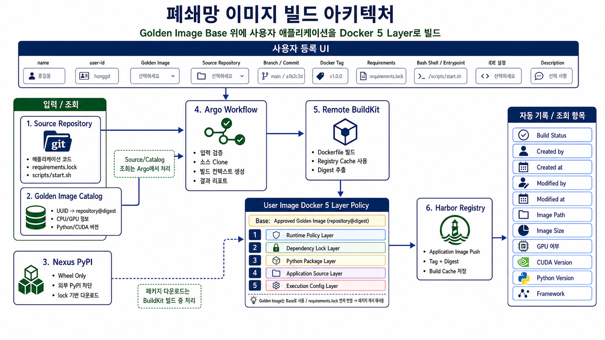

# Explanation Guide

이 문서는 현업 담당자에게 현재 Python Image Builder 구조를 설명할 때 사용하는 가이드입니다.

## 한 줄 요약

이미지 빌드를 `golden`과 `user` 두 타입으로 나누고, Golden Image Catalog를 통해 Python Application Image를 재현 가능하게 빌드하는 구조입니다.

## 왜 필요한가

기존 방식처럼 사용자가 Base Image나 패키지 설치 방식을 직접 정하면 이미지마다 환경이 달라지고, GPU/CUDA/Driver 호환성도 흔들릴 수 있습니다.

이 구조에서는 사용자가 Base Image를 직접 고르지 않습니다. 운영에서 승인한 Golden Image UUID만 선택하고, Workflow가 Catalog에서 해당 UUID를 Harbor `repository@sha256:digest`로 변환해 빌드합니다.



## 전체 흐름

```text
Golden Image Catalog
  -> CPU/GPU Golden Image UUID 선택
  -> Harbor repository@sha256:digest 조회
  -> Git 소스 Clone
  -> requirements.lock 검증
  -> User Image 4 Layer Dockerfile 생성
  -> BuildKit Build/Push
  -> build-report.json 생성
```

## 핵심 구조

```text
workflows/golden-image-build.yaml
- 운영자가 CPU/GPU Golden Image를 생성하는 WorkflowTemplate

workflows/user-image-build.yaml
- 사용자가 Application Image를 생성하는 WorkflowTemplate

manifests/core/golden-image-catalog.configmap.yaml
- CPU/GPU Golden Image UUID와 Digest 매핑

manifests/services/cpu/run-cpu.workflow.yaml
manifests/services/gpu/run-gpu.workflow.yaml
- 실제 서비스 빌드 실행 manifest. B300뿐 아니라 Golden Image Catalog에 등록된 다른 GPU UUID도 사용 가능

scripts/admin/
- Golden/User Workflow Pod 안에서 실행되는 관리자 빌드 스크립트

scripts/user/
- 사용자가 환경변수만 넣고 Workflow를 제출하는 편의 스크립트
```

## CPU와 GPU 처리 방식

Workflow는 이미지 타입 기준으로 `golden`, `user` 두 개로 나뉩니다.

`golden` Workflow는 운영자가 CPU/GPU 기준 이미지를 만들 때 사용합니다.

`user` Workflow는 사용자가 승인된 Golden Image UUID를 선택해 애플리케이션 이미지를 만들 때 사용합니다.

CPU 예시:

```text
golden-image-uuid = py311-cpu-ubuntu2204-20260727
accelerator       = cpu
```

GPU 예시:

```text
golden-image-uuid      = py311-cuda128-b300-ubuntu2204-20260727
accelerator            = cuda
gpu-model              = b300
gpu-architecture       = blackwell
cuda-version           = 12.8
minimum-driver-version = 570.26
```

다른 GPU가 추가되면 User Workflow를 새로 만들지 않습니다. Golden Workflow로 GPU별 기준 이미지를 만들고 Catalog에 Golden Image Record를 추가한 뒤, 실행 manifest 또는 사용자 스크립트의 `golden-image-uuid`만 바꾸면 됩니다.

```text
GPU 추가 방식
1. 운영자가 GPU별 Golden Image를 생성
2. Harbor에 repository@sha256:digest로 Push
3. Golden Image Catalog에 새 UUID 추가
4. 사용자는 새 golden-image-uuid를 선택
5. User Workflow는 동일하게 실행
```

## 파라미터를 추가한 이유

파라미터가 늘어난 이유는 사용자가 더 많이 입력하게 하려는 목적이 아닙니다.

운영에서 이미지 빌드를 안전하게 반복하려면 다음 정보가 빌드 기록에 남아야 합니다.

```text
무엇을 기준 이미지로 썼는지
누가 요청했고 어떤 소스를 빌드했는지
어떤 패키지 버전을 설치했는지
CPU/GPU 중 어떤 실행 환경인지
GPU라면 CUDA/Driver 호환 기준이 무엇인지
컨테이너가 어떤 명령으로 실행되는지
결과 이미지를 어디에 어떤 태그로 올렸는지
```

그래서 파라미터는 크게 네 가지 목적을 가집니다.

| 목적 | 관련 파라미터 | 추가 이유 |
| --- | --- | --- |
| 기준 이미지 통제 | `golden_image_uuid`, `accelerator`, `gpu_model`, `cuda_version`, `minimum_driver_version` | 사용자가 임의 Base Image를 쓰지 않고 승인된 CPU/GPU 이미지만 쓰게 하기 위해 |
| 요청자/재현성 보장 | `user_id`, `git_url`, `git_revision`, `requirements_lock_path`, `context_path` | 누가 요청했는지 남기고 같은 소스와 같은 패키지 버전으로 다시 빌드할 수 있게 하기 위해 |
| 실행 방식 표준화 | `shell_type`, `entrypoint_type`, `entrypoint_value`, `entrypoint_args`, `working_directory`, `run_as_user` | 컨테이너 실행 명령을 Dockerfile 안에 명확히 남기고 Shell 실행을 제한하기 위해 |
| 결과 추적 | `output_repository`, `output_tag`, `image_name`, `environment_profile` | Harbor에 올라간 이미지가 어느 서비스/환경/빌드 결과인지 추적하기 위해 |

현업 설명에서는 이렇게 말하면 됩니다.

```text
파라미터가 늘어난 것은 사용자의 입력 부담을 늘리기 위한 것이 아니라,
운영에서 반드시 관리해야 하는 기준 이미지, 소스, 패키지, 실행 명령, 결과 위치를
빌드 기록으로 남기기 위한 것입니다.
```

## B300 설명 포인트

B300은 일반 Ubuntu 이미지만으로는 운영 기준을 만족하기 어렵습니다.

이유:

- B300은 Blackwell 계열 GPU입니다.
- Blackwell은 CUDA 12.8 이상 기준으로 관리해야 합니다.
- CUDA 12.8 GA 기준 Linux NVIDIA Driver 최소 버전은 570.26입니다.
- 따라서 B300용 Golden Image는 Ubuntu 단독 이미지가 아니라 CUDA/cuDNN/NCCL이 포함된 NVIDIA CUDA 계열 이미지를 내부 Harbor에 미러링해서 사용해야 합니다.

## User Image 4 Layer

User Image는 Golden Image를 첫 번째 레이어로 다시 세는 방식이 아니라, 승인된 Golden Image를 Base로 두고 그 위에 사용자 애플리케이션용 4개 레이어를 추가하는 방식으로 설명합니다.

```text
Golden Image Base
- 운영자가 CPU/GPU 기준 런타임을 만드는 구조
- OS, CUDA, Python, 공통 도구, 보안 정책, 기본 실행 사용자 기준을 고정

User Image 4 Layer
- 사용자가 실제 애플리케이션 이미지를 만드는 구조
- 승인된 Golden Image 위에 requirements.lock, 패키지, 소스, Entrypoint를 고정
```

현업 설명용으로는 이렇게 말하면 됩니다.

```text
Golden Image는 운영 표준 런타임이고,
User Image는 그 표준 런타임 위에 애플리케이션을 4 Layer로 올립니다.
그래서 Golden Image는 Base, User Image는 4 Layer로 구분해서 설명합니다.
```

User Image 4 Layer:

```text
Base. Golden Image Base
   승인된 CPU/GPU Golden Image Digest 사용

1. Dependency Lock Layer
   requirements.lock 먼저 복사

2. Python Package Layer
   Nexus/internal PyPI에서 고정 버전 설치

3. Application Source Layer
   사용자 소스 복사

4. Execution Config Layer
   Shell/Entrypoint/User 설정 적용
```

Runtime Policy는 Golden Image Base에서 상속하고, User Image에서는 `requirements.lock`부터 레이어를 나눕니다.
이 순서로 나눈 이유는 `requirements.lock`이 바뀌지 않으면 패키지 설치 레이어 캐시를 재사용하기 위해서입니다.

## 운영자 역할

운영자는 다음을 준비합니다.

```text
1. CPU/GPU Golden Image 생성
2. Harbor에 repository@digest 형태로 Push
3. manifests/core/golden-image-catalog.configmap.yaml에 UUID와 Digest 등록
4. GPU가 추가되면 GPU별 Golden Image UUID를 Catalog에 추가
5. admin-scripts ConfigMap 배포
6. golden-image-build WorkflowTemplate 등록
7. user-image-build WorkflowTemplate 등록
```

## 사용자 역할

사용자는 다음 값만 선택합니다.

```text
Git Repository
User ID
Branch 또는 Commit
Golden Image UUID
requirements.lock 경로
Image Name / Tag
Shell / Entrypoint
```

사용자는 `runtime-image`, `accelerator`, `gpu-model`, `cuda-version`, `minimum-driver-version`을 직접 입력하지 않습니다. 이 값들은 Golden Image Catalog에서 자동으로 조회됩니다.

## 사용자 UI Shell 설명

사용자 UI에는 Shell/Entrypoint 영역을 별도 그룹으로 보여주는 것을 권장합니다.

```text
Runtime Command
- Shell
- Entrypoint 방식
- 실행 대상
- 실행 인자
- 작업 디렉토리
- 실행 UID
```

설명 포인트:

- Shell은 컨테이너 시작 명령을 감싸는 실행 Shell입니다.
- 일반 Python 서비스는 `bash`를 기본값으로 권장합니다.
- Bash가 없는 경량 이미지에서는 `sh`를 선택할 수 있습니다.
- Entrypoint 방식은 `module`, `script`, `binary`, `shell` 중 하나입니다.
- 사용자가 입력한 값은 Dockerfile의 실행 설정 레이어에 반영됩니다.

예시:

```text
shell-type        = bash
entrypoint-type   = module
entrypoint-value  = src.api
entrypoint-args   = --port 8080
```

위 입력은 컨테이너에서 다음 실행 의도로 해석됩니다.

```text
bash -lc "python -m src.api --port 8080"
```

CPU 실행:

```text
GIT_URL=ssh://git@bitbucket.local/project/app.git \
IMAGE_NAME=my-app-cpu \
scripts/user/submit_cpu_build.sh
```

B300 실행:

```text
GIT_URL=ssh://git@bitbucket.local/project/app.git \
IMAGE_NAME=my-app-b300 \
scripts/user/submit_b300_build.sh
```

제출 전 확인:

```text
DRY_RUN=true \
GIT_URL=ssh://git@bitbucket.local/project/app.git \
scripts/user/submit_cpu_build.sh
```

## 설명할 때 피해야 할 오해

- 이 구조는 B300 전용이 아닙니다.
- Workflow는 GPU마다 새로 만들지 않습니다.
- 사용자는 Base Image를 직접 고르지 않습니다.
- `requirements.lock`은 선택이 아니라 재현성을 위한 필수 입력입니다.
- Golden Image Digest는 태그보다 중요합니다.

## 발표용 짧은 문장

```text
이 구조는 CPU와 GPU별 실행 환경을 Golden Image Catalog로 표준화하고,
사용자는 UUID와 소스/requirements.lock/Entrypoint만 입력해서
Golden/User 두 개의 Argo Workflow로 재현 가능한 Python Image Build를 관리하는 방식입니다.
```
