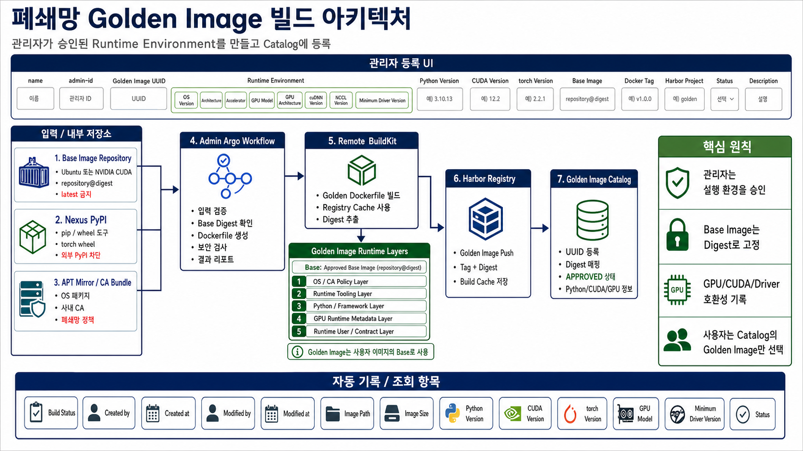

# Golden Image Architecture Explanation

이 문서는 `폐쇄망 Golden Image 빌드 아키텍처` 이미지를 현업 담당자에게 설명할 때 사용하는 관리자용 가이드입니다.



## 한 줄 요약

관리자는 승인된 Runtime Environment를 Golden Image로 만들고, Harbor Digest와 GPU/CUDA/Python 호환 정보를 Golden Image Catalog에 등록합니다.

## 전체 설명 스크립트

```text
이 구조는 폐쇄망에서 사용자가 선택할 수 있는 표준 실행 환경을 만드는 관리자용 아키텍처입니다.

관리자는 UI에서 Golden Image 이름, 관리자 ID, Golden Image UUID,
Runtime Environment, Python Version, CUDA Version, torch Version,
Base Image, Docker Tag, Harbor Project, Status, Description을 입력합니다.

Runtime Environment에는 OS Version, Architecture, Accelerator,
GPU Model, GPU Architecture, cuDNN Version, NCCL Version,
Minimum Driver Version 같은 호환성 기준이 포함됩니다.

Base Image Repository는 Golden Image의 시작점입니다.
Ubuntu 또는 NVIDIA CUDA 이미지를 사용할 수 있지만, 운영에서는 반드시
repository@sha256:digest 형식으로 고정해야 합니다.
latest 태그는 사용하지 않습니다.

Nexus PyPI는 Golden Image 안에 pip, wheel, torch 같은 Python Runtime 도구나
Framework Wheel을 설치할 때 사용합니다.
외부 PyPI는 차단하고 내부 Nexus만 사용합니다.

APT Mirror와 CA Bundle은 폐쇄망 OS 패키지와 사내 인증서 정책을 적용하는 영역입니다.
Golden Image는 사용자 이미지의 Base가 되므로, 이 단계에서 사내 CA와 OS 패키지 기준을 고정합니다.

Admin Argo Workflow는 관리자 입력을 검증하고, Base Image Digest를 확인하고,
Golden Dockerfile을 생성합니다.
필요하면 보안 검사와 결과 리포트 생성도 이 단계에서 수행합니다.

Remote BuildKit은 Golden Dockerfile을 실제로 빌드합니다.
빌드 결과에서 Digest를 추출하고 Registry Cache를 사용해 반복 빌드를 빠르게 만듭니다.

Golden Image Runtime Layers는 운영 표준 실행 환경을 구성하는 레이어입니다.
Approved Base Image 위에 OS/CA 정책, Runtime Tooling, Python/Framework,
GPU Runtime Metadata, Runtime User/Contract 기준을 올립니다.

빌드가 성공하면 Harbor Registry에 Golden Image를 Push합니다.
Harbor에는 Tag와 Digest가 함께 기록됩니다.

마지막으로 Golden Image Catalog에 UUID, Digest, APPROVED 상태,
Python/CUDA/GPU 정보를 등록합니다.
사용자는 이후 User Image Build에서 이 Catalog에 등록된 Golden Image만 선택합니다.
```

## 구성 요소별 설명

| 구성 요소 | 역할 | 설명 포인트 |
| --- | --- | --- |
| 관리자 등록 UI | Golden Image 생성 정보 입력 | 관리자가 Runtime Environment와 승인 정보를 등록합니다. |
| Base Image Repository | 시작 Base Image | Ubuntu 또는 NVIDIA CUDA 이미지를 Digest로 고정합니다. |
| Nexus PyPI | 내부 Python 패키지 저장소 | pip, wheel, torch 등 Runtime/Framework 도구를 내부 저장소에서 설치합니다. |
| APT Mirror / CA Bundle | OS 패키지와 인증서 정책 | 폐쇄망 OS 패키지, 사내 CA, TLS 정책을 Golden Image에 반영합니다. |
| Admin Argo Workflow | 관리자 빌드 오케스트레이션 | 입력 검증, Base Digest 확인, Dockerfile 생성, 보안 검사, 리포트를 담당합니다. |
| Remote BuildKit | Golden Image 빌드 | Dockerfile 빌드, Registry Cache 사용, Digest 추출을 수행합니다. |
| Harbor Registry | Golden Image 저장 | Golden Image를 `Tag + Digest` 기준으로 저장합니다. |
| Golden Image Catalog | 사용자 선택용 Catalog | UUID, Digest, Runtime Metadata, 승인 상태를 등록합니다. |

## 흐름 설명

```text
관리자 등록 UI
  -> Admin Argo Workflow

Base Image Repository
  -> Admin Argo Workflow

Nexus PyPI
  -> Admin Argo Workflow / BuildKit 빌드 중 Python Runtime 설치

APT Mirror / CA Bundle
  -> Admin Argo Workflow / BuildKit 빌드 중 OS, CA 정책 적용

Admin Argo Workflow
  -> Remote BuildKit
  -> Golden Image Runtime Layers
  -> Harbor Registry
  -> Golden Image Catalog
```

## Golden Image Runtime Layers

Golden Image는 사용자 애플리케이션 코드가 들어가는 이미지가 아닙니다.
사용자 이미지가 상속할 표준 Runtime Base를 만드는 이미지입니다.
관리자 Golden Image는 Approved Base Image 위에 5개 Runtime Layer를 추가하는 기준으로 설명합니다.

| 순서 | 레이어 | 목적 |
| --- | --- | --- |
| Base | Approved Base Image | Ubuntu 또는 NVIDIA CUDA 이미지를 Digest로 고정합니다. |
| 1 | OS / CA Policy Layer | 사내 APT Mirror, 공통 OS 패키지, 사내 CA 정책을 적용합니다. |
| 2 | Runtime Tooling Layer | Python 실행에 필요한 pip, setuptools, wheel 같은 기본 도구를 준비합니다. |
| 3 | Python / Framework Layer | Python Version, torch Version 등 Runtime/Framework 기준을 고정합니다. |
| 4 | GPU Runtime Metadata Layer | CUDA, cuDNN, NCCL, GPU Model, Minimum Driver Version을 기록합니다. |
| 5 | Runtime User / Contract Layer | 기본 작업 디렉토리, 실행 UID, Label, Catalog 등록 기준을 고정합니다. |

이 구조를 사용하는 이유는 Golden Image가 여러 사용자 이미지의 공통 Base가 되기 때문입니다.
GPU/CUDA/Driver 호환성, 사내 CA, Python/Framework 기준을 Golden Image에서 먼저 통제해야 사용자 이미지가 흔들리지 않습니다.

## 관리자 UI 입력 기준

| UI 항목 | 필수 | 설명 |
| --- | --- | --- |
| `name` | Y | Golden Image 표시 이름 |
| `admin-id` | Y | 생성/수정 관리자 ID |
| `golden-image-uuid` | Y | 사용자가 선택할 Golden Image 고유 ID |
| `python-version` | Y | Golden Image Python 버전 |
| `cuda-version` | GPU일 때 Y | GPU 이미지 CUDA 버전 |
| `torch-version` | 선택 | PyTorch 기반 Runtime일 때 torch 버전 |
| `base-image` | Y | 내부 Harbor의 Base Image `repository@digest` |
| `docker-tag` | Y | Harbor에 Push할 Golden Image Tag |
| `harbor-project` | Y | Golden Image 저장 Harbor Project |
| `status` | Y | `DRAFT`, `TESTING`, `APPROVED`, `DEPRECATED`, `REVOKED` |
| `description` | 선택 | Golden Image 설명 |
| `gpu-model` | GPU일 때 Y | B300, H100, H200 등 GPU 모델 |
| `gpu-architecture` | GPU일 때 Y | blackwell, hopper 등 GPU 아키텍처 |
| `minimum-driver-version` | GPU일 때 Y | CUDA와 호환되는 최소 NVIDIA Driver |

## 자주 나오는 질문

### Golden Image와 User Image는 무엇이 다른가?

```text
Golden Image = 운영자가 승인한 실행 환경
User Image = Golden Image 위에 사용자 애플리케이션 소스를 올린 최종 이미지
```

Golden Image에는 애플리케이션 소스가 들어가지 않습니다.
대신 OS, Python, CUDA, torch, CA, 기본 실행 정책 같은 공통 Runtime 기준이 들어갑니다.

### 왜 Base Image를 Digest로 고정해야 하나?

같은 태그라도 시간이 지나면 실제 이미지 내용이 바뀔 수 있습니다.
운영 재현성을 보장하려면 `repository@sha256:digest`를 사용해야 합니다.

### GPU/CUDA/Driver 정보는 왜 Catalog에 기록하나?

사용자에게 GPU/CUDA/Driver 값을 직접 입력하게 하면 호환성 오류가 발생하기 쉽습니다.
관리자가 Golden Image 생성 시 호환성 기준을 확정하고 Catalog에 기록해야 사용자는 승인된 Golden Image만 선택하면 됩니다.

### Status는 왜 필요한가?

Golden Image는 생명주기가 있습니다.

```text
DRAFT -> TESTING -> APPROVED -> DEPRECATED -> REVOKED
```

사용자는 보통 `APPROVED` 상태의 Golden Image만 선택할 수 있어야 합니다.
문제가 생긴 이미지는 `REVOKED`로 전환해 신규 빌드에서 사용하지 못하게 막습니다.

## 강조할 핵심 원칙

- 관리자는 실행 환경을 승인합니다.
- Base Image는 Digest로 고정합니다.
- GPU/CUDA/Driver 호환성은 Golden Image 생성 시 기록합니다.
- Python/Framework 기준은 Golden Image에서 먼저 통제합니다.
- 사용자는 Catalog에 등록된 `APPROVED` Golden Image만 선택합니다.
- Harbor Digest와 Golden Image Catalog를 기준으로 재현성과 감사 추적을 보장합니다.
