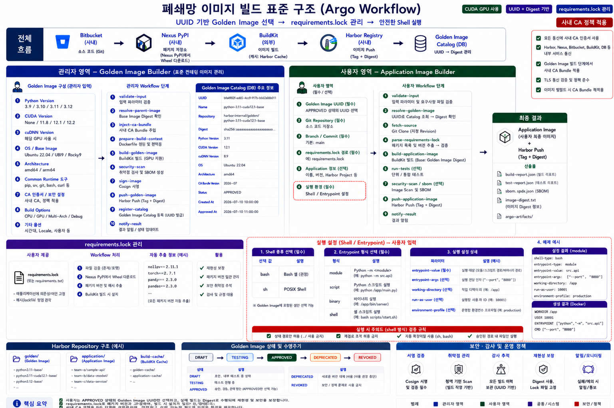

# Image Build Standard Structure Explanation

이 문서는 `폐쇄망 이미지 빌드 표준 구조` 이미지를 현업 담당자에게 설명할 때 사용하는 전체 구조 설명 가이드입니다.



## 한 줄 요약

이 표준 구조는 관리자가 승인한 Golden Image를 기준으로 사용자가 애플리케이션 이미지를 빌드하고, Nexus, BuildKit, Harbor, Catalog를 통해 폐쇄망에서도 재현성과 보안성을 확보하는 구조입니다.

## 전체 설명 스크립트

```text
이 이미지는 폐쇄망에서 이미지 빌드를 표준화하기 위한 전체 구조를 보여줍니다.

상단의 전체 흐름은 Bitbucket, Nexus PyPI, BuildKit, Harbor Registry,
Golden Image Catalog가 어떤 순서로 연결되는지 보여줍니다.

소스 코드는 내부 Bitbucket에서 가져옵니다.
Python 패키지는 외부 PyPI가 아니라 내부 Nexus PyPI에서만 가져옵니다.
이미지 빌드는 원격 BuildKit에서 수행하고, 최종 이미지는 내부 Harbor Registry에 Push합니다.
빌드된 Golden Image와 Application Image는 Tag뿐 아니라 Digest 기준으로 기록합니다.

왼쪽 관리자 영역은 Golden Image Builder입니다.
관리자는 Python Version, CUDA Version, OS/Base Image, Architecture,
공통 Runtime 도구, 사내 CA 정책, Build Option 같은 기준을 입력합니다.
관리자 Workflow는 Base Image Digest 확인, 사내 CA 주입, Dockerfile 생성,
BuildKit 빌드, 보안 검사, 서명, Harbor Push, Catalog 등록을 수행합니다.

오른쪽 사용자 영역은 Application Image Builder입니다.
사용자는 승인된 Golden Image UUID, Git Repository, Branch/Commit,
requirements.lock 경로, Application 정보, Shell/Entrypoint 실행 설정을 입력합니다.
사용자 Workflow는 Catalog에서 UUID를 실제 repository@digest로 변환하고,
소스를 Clone한 뒤 requirements.lock을 검증하고 Application Image를 빌드합니다.

requirements.lock 관리는 별도 영역으로 분리되어 있습니다.
사용자는 의존성 버전을 lock 파일로 고정하고, Workflow는 내부 Nexus PyPI에서 Wheel만 다운로드합니다.
이렇게 하면 빌드 시점마다 패키지 버전이 바뀌는 문제를 줄이고,
외부 네트워크 없이도 재현 가능한 빌드가 가능합니다.

Shell/Entrypoint 영역은 사용자가 컨테이너 실행 방식을 명확하게 입력하는 부분입니다.
Argo Workflow 중간에서 사용자 Shell을 직접 실행하는 것이 아니라,
최종 Docker 이미지의 실행 설정으로 반영합니다.
이 방식은 보안 통제와 재현성 측면에서 더 안전합니다.

하단에는 Harbor Repository 구조, Golden Image 상태와 수명주기,
보안/감사/운영 정책이 정리되어 있습니다.
Golden Image는 DRAFT, TESTING, APPROVED, DEPRECATED, REVOKED 상태로 관리하고,
사용자는 보통 APPROVED 상태의 Golden Image만 선택합니다.

핵심은 사용자가 임의 Base Image를 쓰지 않고,
운영에서 승인한 Golden Image UUID만 선택한다는 점입니다.
실제 빌드는 Digest 기준으로 수행되므로 재현성과 보안성을 확보할 수 있습니다.
```

## 영역별 설명

| 영역 | 설명 | 핵심 포인트 |
| --- | --- | --- |
| 전체 흐름 | Bitbucket, Nexus, BuildKit, Harbor, Catalog의 연결 구조 | 폐쇄망 내부 서비스만 사용 |
| 관리자 영역 | Golden Image를 생성하고 Catalog에 등록 | 운영자가 Runtime 기준을 승인 |
| 사용자 영역 | Application Image를 생성 | 사용자는 Golden Image UUID와 소스/실행 정보만 입력 |
| requirements.lock 관리 | 의존성 버전 고정 | Nexus PyPI, Wheel Only, 외부 PyPI 차단 |
| Shell / Entrypoint | 컨테이너 실행 설정 | 사용자 Shell은 이미지 실행 설정으로 반영 |
| Harbor Repository 구조 | Golden/Application/Build Cache 저장소 분리 | 최종 이미지와 캐시 역할 분리 |
| Golden Image 상태 | DRAFT, TESTING, APPROVED, DEPRECATED, REVOKED | 승인된 이미지 기준으로만 사용자 빌드 허용 |
| 보안/감사/운영 정책 | 서명, Scan, 감사 추적, Digest 고정 | 운영 통제와 재현성 확보 |

## 관리자 영역 설명

관리자 영역은 사용자가 선택할 수 있는 Golden Image를 만드는 영역입니다.

```text
관리자 입력
  -> 입력 검증
  -> Base Image Digest 확인
  -> 사내 CA Bundle 주입
  -> Dockerfile / Build Context 생성
  -> BuildKit 빌드
  -> 보안 검사 / SBOM
  -> 이미지 서명
  -> Harbor Push
  -> Golden Image Catalog 등록
```

관리자는 아래와 같은 기준을 입력합니다.

| 항목 | 설명 |
| --- | --- |
| Python Version | Golden Image의 Python 버전 |
| CUDA Version | GPU 이미지의 CUDA 버전 |
| OS / Base Image | Ubuntu, CUDA Base 등 시작 이미지 |
| Architecture | amd64, arm64 |
| Common Runtime 도구 | pip, uv, git, bash, curl 등 |
| CA 인증서 / 보안 설정 | 사내 CA, 정책 적용 |
| Build Options | CPU/GPU, Multi-Arch, Debug 등 |

관리자 영역에서 중요한 것은 사용자가 직접 입력하지 않아야 할 GPU/CUDA/Driver 기준을 운영자가 먼저 확정한다는 점입니다.

## 사용자 영역 설명

사용자 영역은 승인된 Golden Image 위에 실제 애플리케이션 이미지를 만드는 영역입니다.

```text
사용자 입력
  -> Golden Image UUID 선택
  -> Git Repository / Branch 선택
  -> requirements.lock 지정
  -> Application 정보 입력
  -> Shell / Entrypoint 설정
  -> Application Image Build
  -> Harbor Push
  -> 결과 알림
```

사용자는 Base Image를 직접 입력하지 않습니다.
대신 Golden Image UUID를 선택하면 Workflow가 Catalog에서 실제 `repository@sha256:digest`를 조회합니다.

사용자 입력의 목적은 아래와 같습니다.

| 입력 | 목적 |
| --- | --- |
| Golden Image UUID | 승인된 실행 환경 선택 |
| Git Repository | 애플리케이션 소스 위치 |
| Branch / Commit | 빌드할 소스 버전 |
| requirements.lock 경로 | 패키지 버전 고정 |
| Application 정보 | 이미지명, 버전, Harbor Project 등 |
| 실행 설정 | Shell, Entrypoint, Working Directory, Run As User |

## requirements.lock 설명

`requirements.lock`은 애플리케이션 의존성 버전을 고정하기 위한 기준 파일입니다.

```text
사용자 제공 requirements.lock
  -> Workflow에서 파일 검증
  -> Nexus PyPI에서 Wheel 다운로드
  -> 패키지 버전 및 해시 추적
  -> BuildKit 빌드 시 설치
```

운영 기준은 다음과 같습니다.

- 외부 PyPI를 사용하지 않습니다.
- 내부 Nexus PyPI만 사용합니다.
- Wheel Only 정책을 사용합니다.
- 빌드 시점마다 패키지 버전이 바뀌지 않게 lock 파일을 기준으로 설치합니다.

## Shell / Entrypoint 설명

Shell / Entrypoint는 컨테이너가 시작될 때 어떤 명령을 실행할지 정의하는 영역입니다.

중요한 점은 사용자 Shell을 Argo Workflow 중간에서 직접 실행하지 않는다는 것입니다.
사용자 Shell은 Source Repository 안에 포함되고, Docker 이미지의 실행 설정으로 반영됩니다.

예시:

```text
shell-type       = bash
entrypoint-type  = shell
entrypoint-value = scripts/start.sh
entrypoint-args  = --port 8080
```

최종 이미지는 컨테이너 시작 시 `bash scripts/start.sh --port 8080` 형태로 실행됩니다.

## Harbor 저장소 역할

Harbor Repository는 역할별로 분리합니다.

| 저장소 | 역할 |
| --- | --- |
| `golden/` | Golden Image 저장 |
| `applications/` | 사용자 Application Image 저장 |
| `build-cache/` | BuildKit Registry Cache 저장 |

이렇게 분리하면 운영 표준 Runtime, 사용자 최종 이미지, 빌드 캐시의 책임이 명확해집니다.

## Golden Image 상태와 수명주기

Golden Image는 상태 기반으로 관리합니다.

```text
DRAFT -> TESTING -> APPROVED -> DEPRECATED -> REVOKED
```

| 상태 | 의미 |
| --- | --- |
| DRAFT | 초안 또는 내부 테스트 전 단계 |
| TESTING | 테스트 진행 중 |
| APPROVED | 사용자 선택 가능 상태 |
| DEPRECATED | 신규 사용 중단 예정 |
| REVOKED | 보안/정책 문제로 사용 금지 |

사용자 빌드에서는 보통 `APPROVED` 상태의 Golden Image만 선택하도록 제한합니다.

## 핵심 원칙

- 폐쇄망 내부 서비스만 사용합니다.
- Python 패키지는 Nexus PyPI에서만 가져옵니다.
- Base Image는 Tag가 아니라 Digest로 고정합니다.
- 사용자는 Base Image를 직접 입력하지 않습니다.
- 사용자는 승인된 Golden Image UUID만 선택합니다.
- `requirements.lock`으로 패키지 버전을 고정합니다.
- Shell 실행은 제한된 방식으로 Docker Entrypoint에 반영합니다.
- 최종 결과는 Harbor Tag와 Digest, Build Report로 추적합니다.
