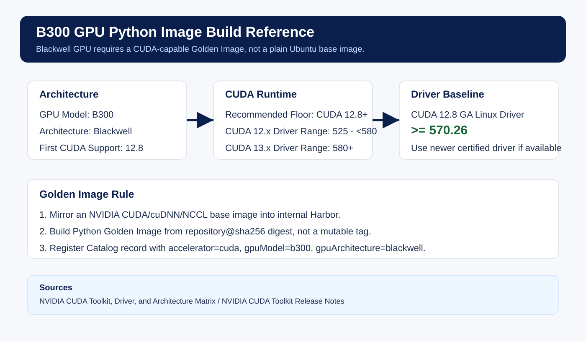

# Operational Workflow Improvement

첨부된 운영 Workflow 문법을 기준으로, 폐쇄망 Python Image Builder를 빠르게 적용할 수 있도록 6단계 Docker Layer 구조로 축소한 개선 방향입니다.

## 반영한 운영 문법

- `WorkflowTemplate` 기반 운영 배포
- `metadata.namespace: argo`
- `serviceAccountName: argo-kserver`
- `parallelism`으로 전체 실행 제한
- `volumeClaimTemplates`의 RWX workspace 공유
- Bitbucket SSH Secret, Harbor Docker Config Secret mount
- `main` DAG 엔트리포인트
- `depends` 기반 명시적 실행 순서
- BuildKit remote daemon 기반 이미지 빌드
- Registry cache import/export
- build report JSON 생성
- Workflow 인라인 스크립트 제거 및 ConfigMap 기반 스크립트 마운트

## 6단계 Workflow

| 단계 | Workflow Task | 목적 |
| --- | --- | --- |
| 1 | `step-1-validate-input` | Git URL, Shell, Entrypoint 입력값 검증 |
| 2 | `step-2-resolve-golden-image` | Golden Image UUID 또는 `runtime-image`를 Digest 이미지로 확정 |
| 3 | `step-3-fetch-source` | Bitbucket 소스 Clone 및 Branch/Commit 체크아웃 |
| 4 | `step-4-create-6-layer-dockerfile` | `context-path`, `requirements-lock-path` 기준 검증 및 6단계 Dockerfile 생성 |
| 5 | `step-5-build-and-push-image` | BuildKit으로 이미지 Build/Push |
| 6 | `step-6-write-result` | 이미지 Digest와 빌드 리포트 생성 |

## 분리된 스크립트

| 스크립트 | 호출 Task | 역할 |
| --- | --- | --- |
| `scripts/admin/validate_input.py` | `step-1-validate-input` | 입력 파라미터 검증 및 Repository 이름 추출 |
| `scripts/admin/resolve_golden_image.py` | `step-2-resolve-golden-image` | Golden Image UUID 또는 Runtime Image Digest 확정 |
| `scripts/admin/fetch_source.sh` | `step-3-fetch-source` | Git Clone 및 Branch/Commit 체크아웃 |
| `scripts/admin/create_6_layer_dockerfile.sh` | `step-4-create-6-layer-dockerfile` | Lock 검증, Build Context 생성, 6단계 Dockerfile 생성 |
| `scripts/admin/build_and_push_image.sh` | `step-5-build-and-push-image` | BuildKit Build/Push 및 Digest 추출 |
| `scripts/admin/write_result.sh` | `step-6-write-result` | 빌드 결과 JSON 생성 |

## 사용자 실행 스크립트

| 스크립트 | 역할 |
| --- | --- |
| `scripts/user/submit_cpu_build.sh` | CPU 실행 manifest에 사용자 값을 채워 Workflow 제출 |
| `scripts/user/submit_b300_build.sh` | B300 실행 manifest에 사용자 값을 채워 Workflow 제출 |

## 6단계 Docker Layer

| 단계 | Dockerfile 영역 | 목적 |
| --- | --- | --- |
| 1 | Golden Image Layer | Python, OS, CUDA, CA 정책을 승인된 Base Digest에서 상속 |
| 2 | Runtime Policy Layer | `WORKDIR`, Python/Pip, GPU Runtime 환경 정책 고정 |
| 3 | Dependency Lock Layer | `requirements.lock`만 먼저 복사해 캐시 효율 확보 |
| 4 | Python Package Layer | Nexus/내부 PyPI에서 고정 버전 설치 |
| 5 | Application Source Layer | 사용자 소스 복사 |
| 6 | Execution Config Layer | Shell/Entrypoint 실행 설정 적용 |

## 개선한 점

- 전체 구조를 관리자/사용자/카탈로그/병렬 타깃 전체 구현이 아닌 단일 Application Image Build로 축소했습니다.
- `golden-image-uuid`가 있으면 Catalog에서 `repository@digest`를 조회하고, 없으면 `runtime-image`를 직접 사용합니다.
- `runtime-image`는 반드시 `repository@sha256:<64 hex>` 형식으로 검증합니다.
- CPU와 여러 GPU 타입을 같은 Workflow에서 Golden Image UUID로 선택합니다.
- GPU용 Golden Image는 일반 Ubuntu가 아니라 GPU 아키텍처에 맞는 NVIDIA CUDA/cuDNN/NCCL 기반 Base Image를 내부 Harbor에 미러링해서 사용합니다.
- B300은 현재 등록된 GPU 예시이며 `accelerator=cuda`, `gpu_model=b300`, `gpu_architecture=blackwell`, `cuda_version>=12.8` 기준으로 검증합니다.
- 다른 GPU는 Catalog Record 추가로 확장합니다.
- `requirements.lock`만 허용해 의존성 버전 흔들림을 막습니다.
- Dockerfile에서 `requirements.lock`을 소스보다 먼저 복사해 패키지 레이어 캐시를 살립니다.
- Branch/Commit, Context Path, Lock 파일 경로, 이미지명, 작업 디렉토리, 실행 UID, 환경 프로파일을 파라미터로 받습니다.
- BuildKit metadata에서 최종 image digest를 검증합니다.

## 추천 적용 순서

1. `manifests/golden-image-catalog.configmap.yaml`의 Catalog를 운영 값으로 교체합니다.
2. `harbor-registry-auth`, `bitbucket-ssh-key` Secret 이름을 운영 Secret과 맞춥니다.
3. `kubectl apply -k .`로 `python-admin-scripts` ConfigMap을 생성합니다.
4. `workflows/python-image-build-6-layer.yaml`의 `CHANGE_ME` 값을 운영 주소로 치환합니다.
5. `manifests/run-cpu.workflow.yaml` 또는 `manifests/run-b300.workflow.yaml`를 서비스별 값으로 수정합니다.
6. 또는 `scripts/user/submit_cpu_build.sh`, `scripts/user/submit_b300_build.sh`에 환경변수를 넘겨 실행합니다.
7. `entrypoint-type`, `entrypoint-value`, `shell-type`을 서비스별 실행 방식에 맞춥니다.
8. 먼저 CPU 실행 manifest로 검증하고, GPU는 Catalog/Driver/CUDA 기준 확인 후 실행합니다.
